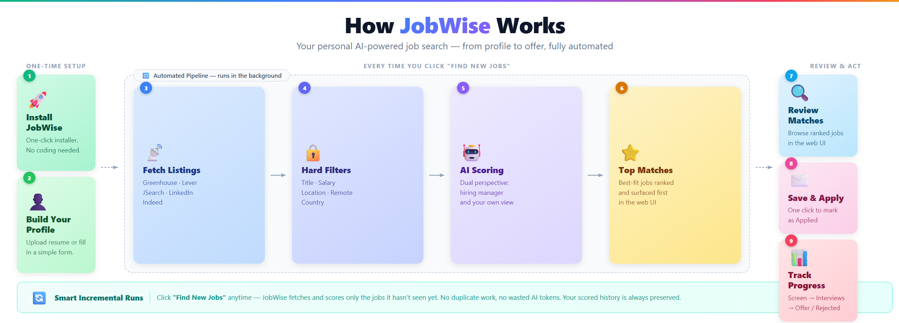
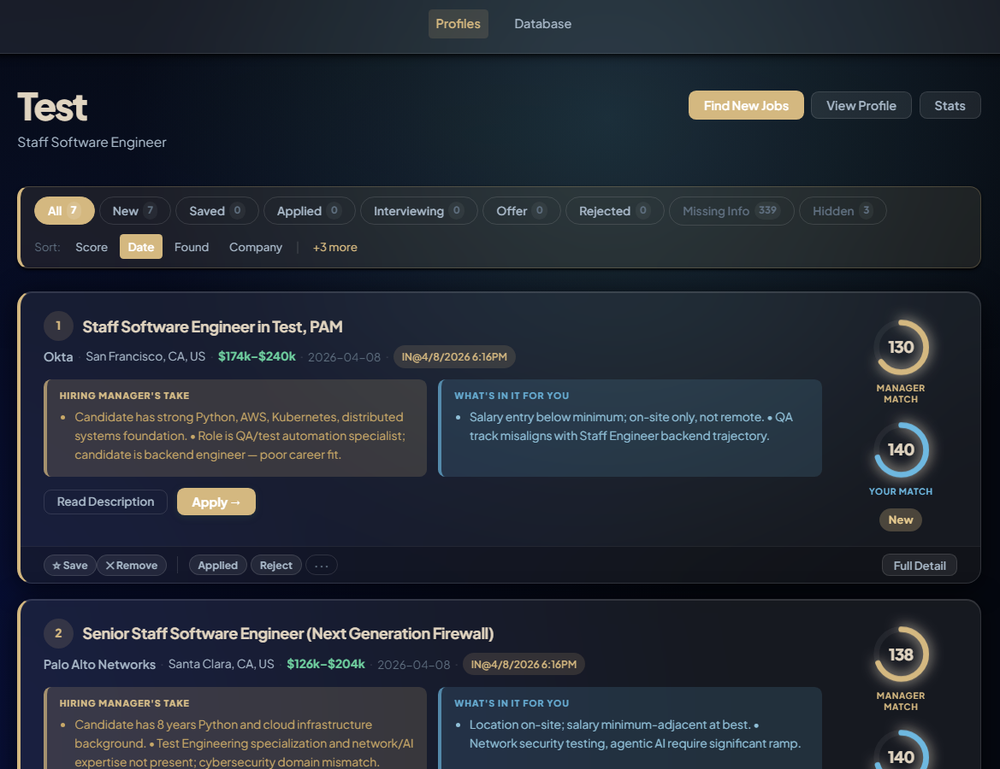
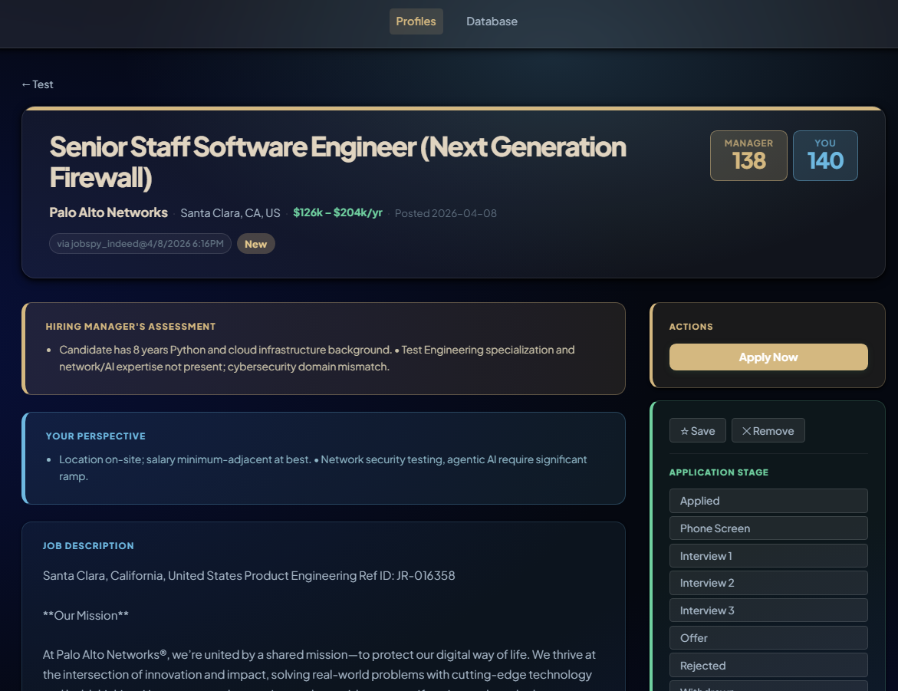
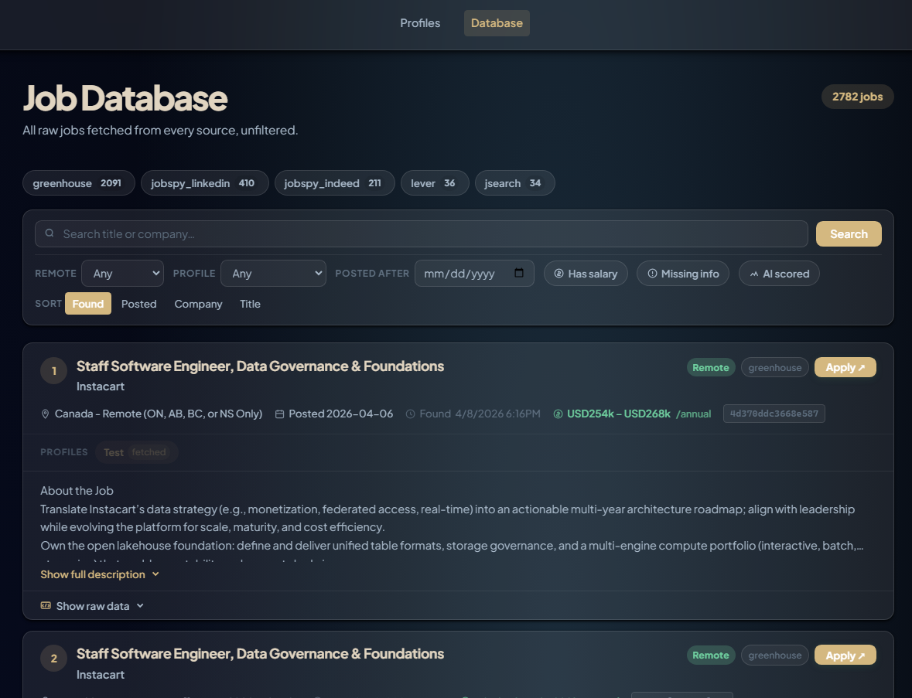
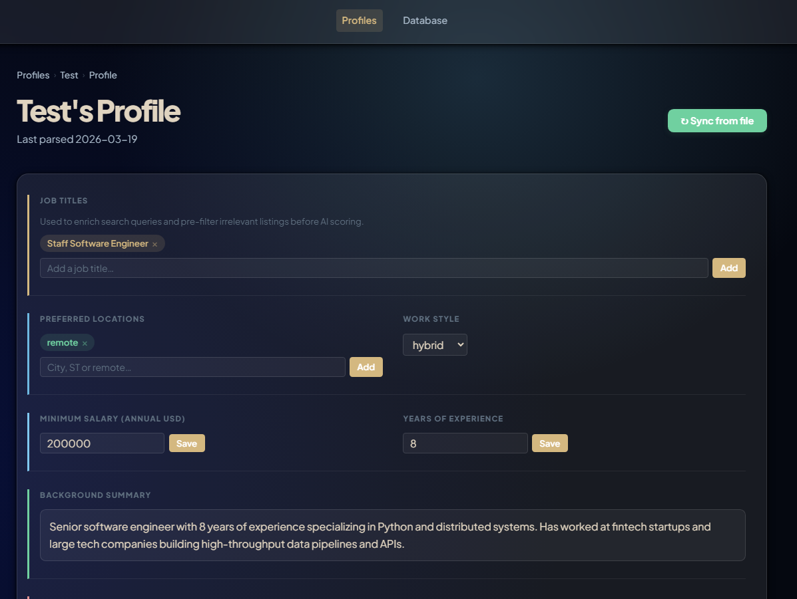

# JobWise


[](https://buymeacoffee.com/starbringer)

A self-hosted, AI-powered job search assistant. It fetches postings from multiple sources, scores each one against your personal profile, and serves a local web UI where you review matches and track your applications.

> **Self-hosted and private** — your profile and job data stay on your machine. Only your profile text and job descriptions are sent to the AI provider you choose.

---

## How it works



---

## ⚡ Quick Start

**Download and double-click.**

| Platform | Download | Then… |
|----------|----------|-------|
| **Windows** | [**JobWise-Setup.exe**](https://github.com/starbringer/JobWise/releases/latest/download/JobWise-Setup.exe) | Double-click the downloaded file |
| **Mac** | [**JobWise-Mac.dmg**](https://github.com/starbringer/JobWise/releases/latest/download/JobWise-Mac.dmg) | Open the DMG, then double-click **Install JobWise** |

A setup wizard walks you through your API keys, profile file, and optional AI import when the installer finishes. If your AI provider is configured, the wizard offers to import your profile immediately so it's ready when you open the app.

> **Mac note:** macOS blocks apps from unidentified developers by default. If you see a warning, there are two ways to allow it:
> 1. **Right-click method (quickest):** Right-click (or Control-click) the `.command` file inside the DMG → **Open** → **Open** to allow it once.
> 2. **System Settings method:** If the right-click method doesn't show an "Open" option, open **System Settings → Privacy & Security**, scroll to the bottom, and click **"Open Anyway"** next to the blocked app. You may need to enter your Mac password.

**After setup, to open JobWise each day:**
- **Windows** — double-click **`start.bat`** in your `JobWise` folder (default: `C:\Users\YourName\JobWise`)
- **Mac** — double-click **`start.sh`** in your `JobWise` folder (default: `~/JobWise`)

This opens a terminal window running the app. **To stop JobWise**, switch to that terminal and press `Ctrl+C` (or close the terminal window). Closing the browser tab alone does not stop it.

> **First run heads-up:** The first time you click "Find New Jobs", JobWise fetches and scores a large batch of jobs. This can take **30–60 minutes** depending on how many jobs are found and uses a significant number of AI tokens. If you hit a usage limit mid-way through, the run will stop automatically — just click "Find New Jobs" again later and it will pick up where it left off, only scoring the jobs it hasn't seen yet.

> Already comfortable with Python and Git? See [For Technical Users](#for-technical-users) below for the manual setup.

---

## Features

- **Multi-source fetching** — Greenhouse, Lever, JSearch, and JobSpy (LinkedIn/Indeed)
- **AI scoring** — each job scored from both a hiring-manager and candidate perspective
- **Hard-requirement filtering** — titles, companies, remote type, salary, country, clearance, and industry filters applied before any AI tokens are spent
- **Any AI provider** — claude.ai (free with your subscription, no API key), Gemini, OpenAI, Anthropic, or local Ollama; no lock-in
- **Multiple profiles** — manage separate job searches side by side (e.g. different roles, markets, or seniority levels), each with independent scoring and history
- **Application tracking** — move jobs through a full pipeline (applied → phone screen → interviews → offer/rejected) and save bookmarks; saved and active-stage jobs are never auto-removed
- **Incremental runs** — only new jobs are fetched and scored on repeat runs
- **Resume as profile** — drop in your resume as `.txt`, `.md`, `.pdf`, or `.docx` to get started instantly
- **Preferred companies** — pin a per-profile list of companies that are always searched on every run, editable directly in the profile page
- **Settings UI** — configure AI provider, pipeline limits, job sources, scoring weights, and scheduler from the browser; changes sync to `config.yaml` and take effect immediately without restarting
- **Web UI** — browse matches, edit your profile, view pipeline history, and choose from 9 color themes (Pine, Black, Forest, Midnight, Ocean, Sunset, Lavender, Linen, Fjord); mobile-friendly — accessible from any device on the same Wi-Fi network
- **Scheduler** — runs automatically via Windows Task Scheduler or cron

---

## Screenshots

**Job list** — ranked matches for your profile, with AI scores from both the hiring manager's and your own perspective, salary, location, and quick-action buttons.



**Job detail** — full AI assessment, job description, salary range, and application stage tracker in one view.



**Job database** — every raw job fetched across all sources and profiles, with filtering by source, remote type, and score status.



**Profile editor** — structured profile with target titles, locations, work style, salary, and experience summary; editable directly in the browser.



---

## ☕ Support This Project

If JobWise has saved you hours of mindlessly scrolling job boards (or at least made the hunt slightly less soul-crushing), consider buying me a coffee. It helps keep the project alive and the caffeine levels stable.

**[☕ Buy Me a Coffee](https://buymeacoffee.com/starbringer)**

No pressure at all — the software is and always will be free. But if you land a great job with it, you know where to find me. 😄

---

## Getting Started

### What you'll need

- **Python 3.11+** — [download here](https://python.org)
- **A free RapidAPI account** — for the JSearch job source
- **An AI provider** — pick the one that fits you:

  | Option | Cost | What you need |
  |--------|------|---------------|
  | **claude.ai** | Free (included in claude.ai subscription) | A [claude.ai](https://claude.ai) Pro or Max subscription + Claude Code installed — [see setup below](#using-claudeai-as-your-ai-provider) |
  | **Google Gemini** | Free tier available | A free API key from [aistudio.google.com](https://aistudio.google.com) |
  | **OpenAI** | Paid | A paid API key from [platform.openai.com](https://platform.openai.com) |
  | **Anthropic** | Paid | A paid API key from [console.anthropic.com](https://console.anthropic.com) |
  | **Ollama** | Free (runs on your computer) | [ollama.com](https://ollama.com) — no account, no key, no internet |

---

## For Non-Technical Users

The easiest way to get started is the one-click installer — see the [Quick Start](#-quick-start) section above. Download one file, double-click it, and the installer handles everything: Python (if not already installed), all packages, your API keys, and your profile. It takes about 5 minutes.

**After setup, daily use:**
- **Windows** — double-click **`start.bat`** in your `JobWise` folder
- **Mac** — double-click **`start.sh`** in your `JobWise` folder

This opens a terminal window running the app. **To stop JobWise**, switch to that terminal and press `Ctrl+C` (or just close the terminal window). Closing the browser tab alone does not stop it.

Then click **Find New Jobs** on your profile to fetch and score the latest postings. The first search can take 30–60 minutes depending on how many jobs are found; repeat searches are much faster since only new postings are scored.

For help using the web UI, see the **[User Guide →](docs/user-guide.md)**

<details>
<summary>Manual setup steps (reference)</summary>

If you prefer to set up manually or something goes wrong with the wizard, here are the individual steps.

### Step 1 — Install Python

Download Python 3.11 or later from [python.org](https://python.org). During installation, check **"Add Python to PATH"**.

### Step 2 — Download the project

Download and unzip this project to any folder on your computer.

### Step 3 — Install dependencies

Open a terminal in the project folder:

```bash
python -m venv venv

# Windows
venv\Scripts\activate

# macOS / Linux
source venv/bin/activate

pip install -r requirements.txt
```

### Step 4 — Get your API keys

**JSearch (job data — free):**
1. Create a free account at [rapidapi.com](https://rapidapi.com)
2. Search for **JSearch** → Subscribe → select **BASIC (Free)** — 200 requests/month
3. Copy your `X-RapidAPI-Key` from the dashboard
4. Note the day-of-month you signed up (e.g. signed up on the 5th → you'll use `5` in config)

**AI provider — pick one:**

| Provider | Cost | Notes |
|----------|------|-------|
| claude.ai | Free with claude.ai Pro/Max subscription | No API key — see [setup below](#using-claudeai-as-your-ai-provider) |
| Google Gemini | Free tier available | Get a key at [aistudio.google.com](https://aistudio.google.com) |
| OpenAI | Paid | Get a key at [platform.openai.com](https://platform.openai.com) |
| Anthropic | Paid | Get a key at [console.anthropic.com](https://console.anthropic.com) |
| Ollama | Free, runs locally | No key needed — [ollama.com](https://ollama.com) |

### Step 5 — Create your `.env` file

> **Claude Code CLI users:** skip the AI key below — no API key is needed. Only add `JSEARCH_API_KEY`.

Create a file named `.env` in the project root. Add the keys that apply to your setup:

```
JSEARCH_API_KEY=your_rapidapi_key_here

# Add only the one that matches your chosen AI provider:
GEMINI_API_KEY=your_gemini_key_here
OPENAI_API_KEY=your_openai_key_here
ANTHROPIC_API_KEY=your_anthropic_key_here
```

### Step 6 — Configure the app

```bash
# Windows
copy config\config.sample.yaml config\config.yaml

# macOS / Linux
cp config/config.sample.yaml config/config.yaml
```

Copy `config.sample.yaml` to `config.yaml` — no manual edits required at this point. All settings (AI provider, model, pipeline limits, job sources, JSearch quota reset day, scoring weights, scheduler, and more) can be configured from the **Settings** tab in the web UI after the app starts. Changes sync to `config.yaml` instantly without restarting the server.

### Step 7 — Create your profile

Place your resume in the `profiles/` folder (`.txt`, `.md`, `.pdf`, or `.docx`). The filename without the extension becomes your profile name (e.g. `profiles/alice.pdf` → profile name `alice`).

> ⚠️ **Privacy:** Remove personal identifiers (name, phone, address, email) before saving. The AI only needs your skills and preferences.

### Step 8 — Start the web app and import your profile

```bash
python run_web.py
```

Open **http://localhost:6868**. If no profile has been imported yet, use the **Load Profile File** form on the Profiles page to point JobWise at your file. The AI will extract your profile details (takes ~30–60 seconds), then click **Find New Jobs**.

### Step 9 — Set up automatic scheduling (optional)

**Windows (run as Administrator):**
```
scheduler\install-task.bat
```

**macOS / Linux:**
```bash
bash scheduler/install-cron.sh
```

</details>

That's it! For help managing saved jobs, tracking your applications, and getting the most out of the web UI, see the **[User Guide →](docs/user-guide.md)**

---

## Using claude.ai as your AI provider

If you have a **claude.ai Pro or Max subscription**, you can use it directly — no extra API key or billing needed. JobWise uses Claude Code (included with your subscription) to score jobs.

**JobWise does not log you in.** You need to install Claude Code and sign in once — then JobWise will use it automatically.

### Step 1 — Install Claude Code

Go to **[claude.ai/code](https://claude.ai/code)** and follow the download instructions for your platform (Windows or Mac).

### Step 2 — Sign in

After installing, open a terminal (Command Prompt on Windows, Terminal on Mac) and run:
```
claude login
```
A browser window will open — sign in with your claude.ai account. You only need to do this once.

### Step 3 — Verify it works

In the same terminal, run:
```
claude -p "Say hello"
```
If you see a response, you're all set.

### Step 4 — Select it in the setup wizard

When the setup wizard asks which AI provider to use, choose **claude.ai**. The wizard will prompt you to complete the steps above and then configure JobWise automatically.

If you've already finished setup and want to switch to claude.ai later, open the **Settings** tab in the JobWise web UI and change **AI Provider** to `claude_cli`.

---

## For Technical Users

If you're comfortable with Python and want the full picture — pipeline flags, advanced config, scheduler options, adding job sources, and more — see the **[Advanced Guide →](docs/advanced.md)**

---

## Search Sources

| Source | Type | Quota |
|--------|------|-------|
| **Greenhouse** | Company ATS board | Free, unlimited |
| **Lever** | Company ATS board | Free, unlimited |
| **JSearch** | RapidAPI | 200 req/month (free tier) |
| **JobSpy** | Web scraper | No API key needed |

JSearch credits are spent only on companies without a free Greenhouse/Lever board. General keyword searches use JobSpy. See [Legal Notice](#legal-notice) for JobSpy terms.

---

## Project Structure

```
jobwise/
├── installer/
│   ├── windows/jobwise.nsi      # NSIS script — builds JobWise-Setup.exe (via GitHub Actions)
│   └── mac/install.command      # Script bundled inside JobWise-Mac.dmg
├── .github/workflows/release.yml # Builds installers and attaches them to GitHub Releases
├── setup.bat / setup.sh         # Setup wizard launcher (used after manual/git install)
├── start.bat / start.sh         # Daily launcher — opens the web app
├── setup_wizard.py              # Setup wizard script (called by installers and setup.bat/sh)
├── config/
│   ├── config.yaml              # All settings (editable via Settings tab in the UI)
│   └── preferred_companies.txt  # Legacy: per-profile list is now in the profile page
├── profiles/
│   └── yourname.txt             # Your career profile (plain text)
├── data/                        # Created automatically on first run
│   └── jobs.db                  # SQLite database
├── src/
│   ├── pipeline.py              # Main pipeline entry point
│   └── sources/                 # Job sources (Greenhouse, Lever, JSearch, JobSpy)
├── web/                         # Flask web app
├── scheduler/                   # Scheduling scripts
├── docs/                        # Extended documentation
│   ├── user-guide.md            # Web UI and application tracking guide
│   └── advanced.md              # Technical reference
├── run_web.py                   # Web app entry point
├── requirements.txt
└── .env                         # API keys (never commit)
```

---

## Legal Notice

This project is licensed under the [Apache License 2.0](LICENSE).

### JobSpy / web scraping

The JobSpy integration scrapes LinkedIn, Indeed, and similar job boards by simulating browser requests. **The Terms of Service of these platforms generally prohibit automated access.**

- This project does not endorse or encourage violating any platform's Terms of Service.
- JobSpy is **opt-out by default** — disable it at any time with `sources.jobspy: false` in `config/config.yaml`.
- **You are solely responsible** for how you use this software.

---

## Contributing

Contributions are welcome. To get started:

1. Fork the repository and create a branch from `master`
2. Make your changes — keep them focused and minimal
3. Test locally against a real profile and database
4. Open a pull request with a clear description of what changed and why

Please open an issue before starting significant changes.

---

## License

[Apache License 2.0](LICENSE) — free to use, modify, and distribute. Attribution required: retain the copyright notice and license file in all copies and derivative works.
